# HarukiProxy 介绍与教程

## 什么是HarukiProxy

HarukiProxy是由*Haruki Dev Team*开发的一款Android平台**半自动**抓取游戏pjsk的数据的程序

## HarukiProxy的特点

- 支持`日服`、`台服`、`韩服`、`国际服`数据抓取
- 支持**自动上传数据**到Haruki工具箱
- 支持选择是否公开自己自动上传到Haruki工具箱的数据在公开API访问
- 支持自定义上传数据端点 (需第三方服务支持)
- 支持保存抓取的数据到本地
- 支持保存抓取的suite数据到本地
- 支持保存抓取的mysekai数据到本地
- 支持自动为**MuMu模拟器**或其他可Root和可写系统盘的Android设备/模拟器安装MitM证书
- 支持adb自动操作**多个**Android设备
- 支持自动为Android设备设置HarukiProxy为代理
- 支持自定义上游HTTP代理

## **初期准备**

***本程序自动化功能仅针对MuMu模拟器或其他可手动获取root可写系统盘的设备***

***如果你的Android手机正在使用Magisk/KernelSU等程序，请搜索“Always Trust User Certs”获取详细教程，并且手动设置代理服务器，本文不再赘述***

> [!tip]
>
> 配置出现问题时请跳转至[问题自查](# 问题自查)先查找是否为常见问题，再借助搜素引擎和ai尝试解决问题，最后再在群聊里问群友，不会提问的请务必先阅读[提问的智慧](https://github.com/ryanhanwu/How-To-Ask-Questions-The-Smart-Way/blob/main/README-zh_CN.md)

根据你的系统，选择并下载最新版的HarukiProxy

- [HarukiProxy-Windows-x64](/HarukiProxy/HarukiProxy-v1.4.0-windows-x64.zip)
- [HarukiProxy-Linux-amd64](/HarukiProxy/HarukiProxy-v1.4.0-linux-amd64.tar.gz)
- [HarukiProxy-Linux-arm64](/HarukiProxy/HarukiProxy-v1.4.0-linux-arm64.tar.gz)
- [HarukiProxy-macOS-arm64](/HarukiProxy/HarukiProxy-v1.4.0-macos-arm64.tar.gz)

下载完成后，将压缩包放至自己喜欢的目录，然后进行解压

> [!caution]
>
> ***请不要使用系统自带的解压方式！！！由于会产生很多不必要的问题，这里极度建议下载一个解压软件对压缩包进行解压***
>
> ***本文推荐使用7-zip 官网地址：https://www.7-zip.org/***

解压后，目录应该有如下文件

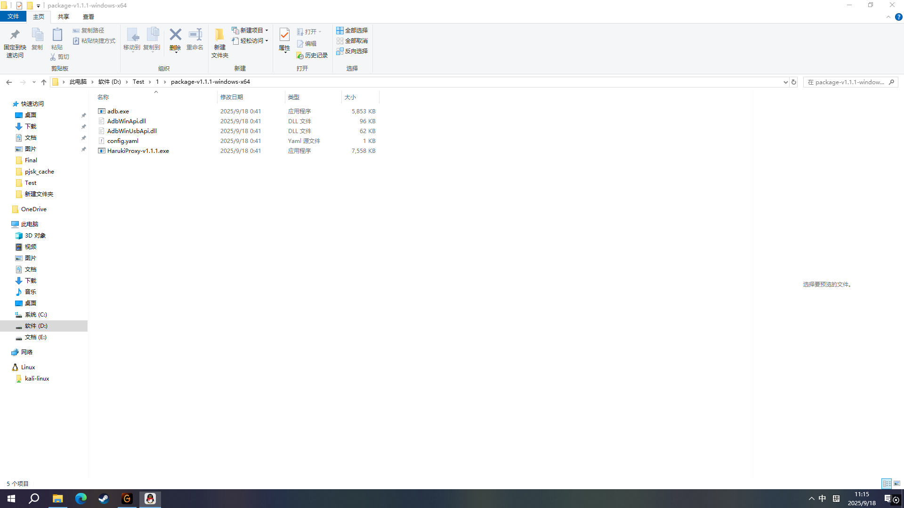

```
目录名：HarukiProxy-vx.x.x-windows-x64
adb.exe
AdbWinApi.dll
AdbWinUsbApi.dll
config.yaml
harukiProxy-vx.x.x.exe
如果没有开启查看后缀名，可能会看不到.后的内容
```

> [!tip]
>
> 如果你的系统不是Windows，请自行准备adb工具，并且添加到环境变量里

## 配置config.yaml

推荐使用`vscode`等专业编辑器进行配置，记事本也可以使用，但有可能出错

打开文件后，默认配置应该如下

```
auto_upload: true # 是否自动上传数据到Haruki Toolbox，一般不需要改为false

private: true # 是否不公开你的数据在Haruki Suite API公开API上，如果是请保持为true，如果想公开则改为false

upload_endpoint: "" # 自定义上传数据端点

save_data_locally: false # 是否自动保存数据到本地，如果你有需求可以改为true

save_data_dir: "./data" # 自动保存的数据路径

save_suite_locally: true # 是否自动保存suite数据到本地，如果save_data_locally未启用，则该选项不会生效

save_mysekai_locally: true # 是否自动保存mysekai数据到本地，如果save_data_locally未启用，则该选项不会生效

listen: "0.0.0.0:8888" # MitM监听，一般情况下无需更改

adb: true # 是否启用 ADB

auto_install_cert: true # 是否自动安装证书，如果使用的不是MuMu模拟器可以设置为false

android_proxy_ip: "" # 手动设置代理IP，如果自动获取IP并设置会导致模拟器/设备无法联网，请填写此项

goproxy_debug: false # 启用调试模式，如果有问题时请改为true，否则保持false即可

goproxy_upstream_proxy: "" # 上游代理，如果连接状况不佳可以设置(如"http://127.0.0.1:6152")，否则留空即可

# Android 设备列表
devices:
  - serial: "" # 有线连接的Android设备名
    wireless: "127.0.0.1:16384" # 无线连接的Android设备名（IP:端口）

  # 可继续添加更多设备
  # - serial: "device_serial"
  #   wireless: "ip:port"
```

我们所要做的主要改动有以下几点

在上述配置文件中找到**# Android 设备列表**，并修改它下面

```
devices:
  - serial: "" # 有线连接的Android设备名
    wireless: "127.0.0.1:16384" # 无线连接的Android设备名（IP:端口）
```

中wireless后面的这串数字:后的16384改为**你模拟器**的adb端口

### 端口的获取方式

1. 在MuMu模拟器的模拟器管理界面，也就是打开之后的初始界面，点击右上角的三条杠

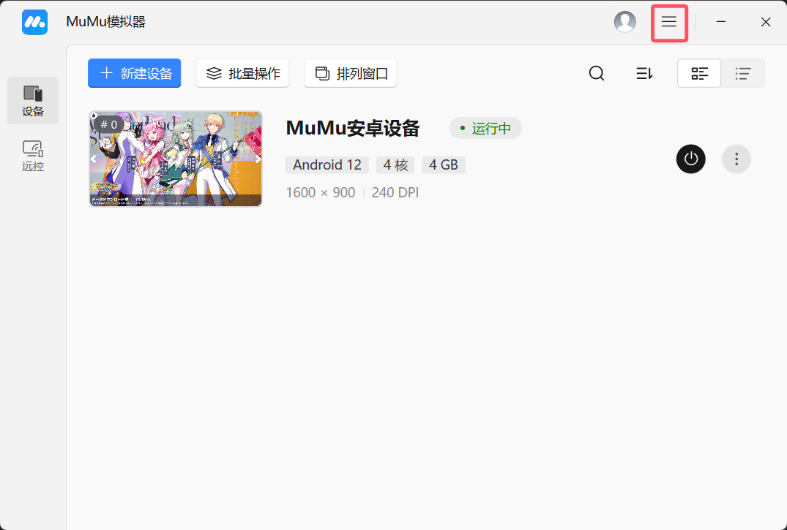

2. 之后选择设备中心

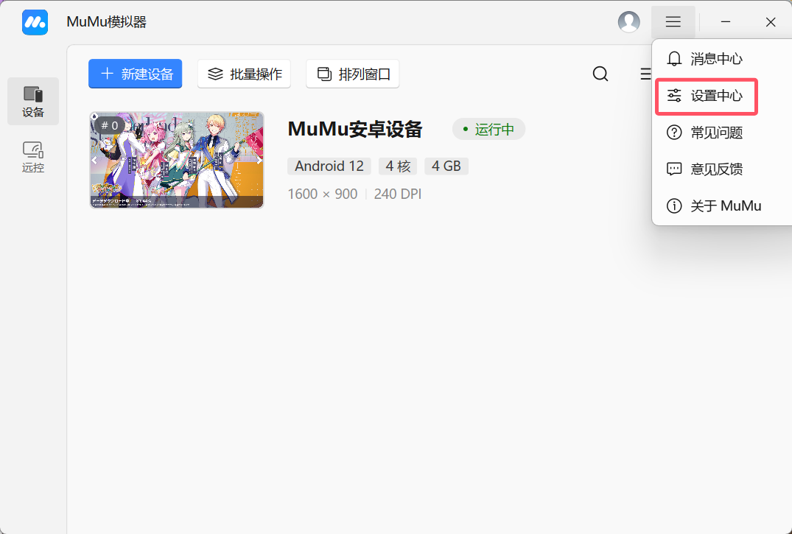

3. 向下滑找到ADB端口

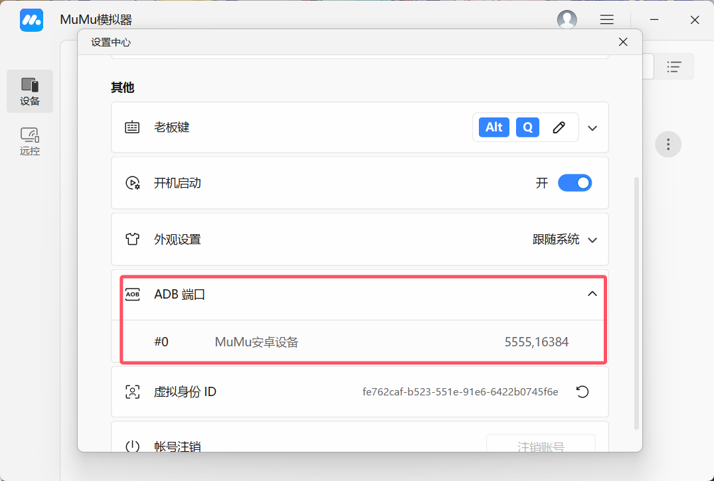

4. 点开之后找到你准备进行抓包流程的那个模拟器，右边的就是ADB端口（两个端口都可以使用，注意这里有两个端口被，隔开了）

```
结果为wireless: "127.0.0.1:你得到的模拟器的端口"
```

**harukiproxy的主要配置到此结束**

## 其他配置

- `save_data_locally: false` # 是否自动保存数据到本地，如果你有需求可以改为true

- `save_data_dir: "./data"` # 自动保存的数据路径

- `save_suite_locally: true` # 是否自动保存suite数据到本地，如果`save_data_locally`未启用，则该选项不会生效

- `save_mysekai_locally: true `# 是否自动保存mysekai数据到本地，如果`save_data_locally`未启用，则该选项不会生效

  这一部分控制你是否将抓取到的数据保存在本地，如果你想要查看自己的suite与mysekai数据，抑或是想要手动上传数据，那么就将`save_data_locally: false`改为 true，数据则会自动保存在你HarukiProxy目录下的data目录

- `private: true` # 决定除了HarukiBot外的bot能否获取到你的数据，如果你只想使用haruki bot就不用更改，如果向同步到其它bot就改为 false

- `goproxy_upstream_proxy: ""` # 上游代理，如果连接状况不佳可以设置(如"http://127.0.0.1:6152")，否则留空即可

  如果你不是很清楚代理是什么意思，那么不用管了，否则和注释一样，将6152改为你代理软件中找到的端口号

- `upload_endpoint: ""` # 自定义上传数据端点，不修改则默认上传至haruki toolbox的数据上传端点，你可以修改为想传到的其他端点地址

> [!caution]
>
> 记得按下Ctrl+S来保存你所做的更改

## 更改MuMu模拟器设置

1. 接着，打开你的MuMu模拟器，点击右上角的**. . .**  ，

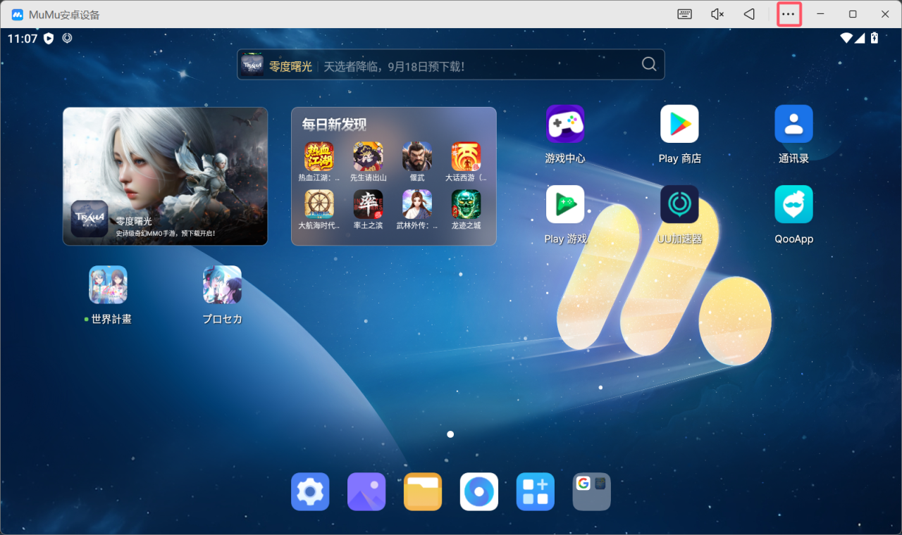

2. 并在弹出的菜单里选择设备设置

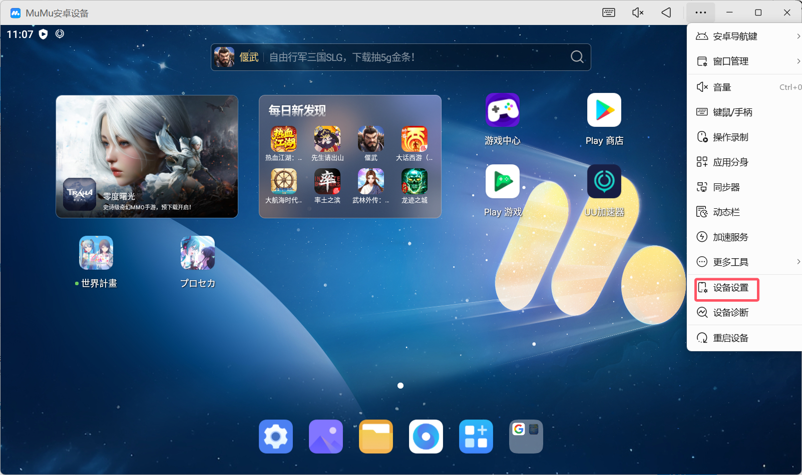

3. 在设备设置中选择最下面的“其他”，找到root权限后点击右边的按钮开启

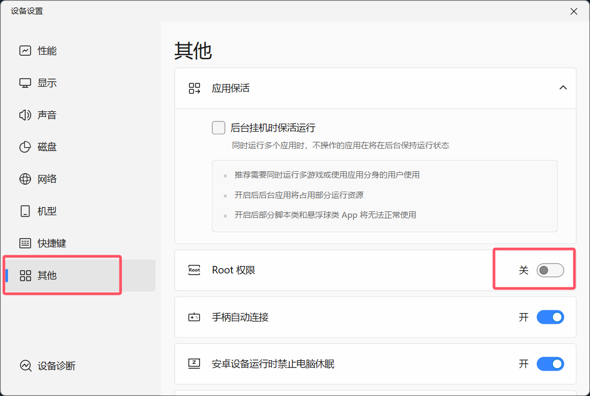

4. 之后，选择“磁盘”，点击其中的磁盘共享，然后将只读系统盘切换为可写系统盘，暂时不要重启模拟器

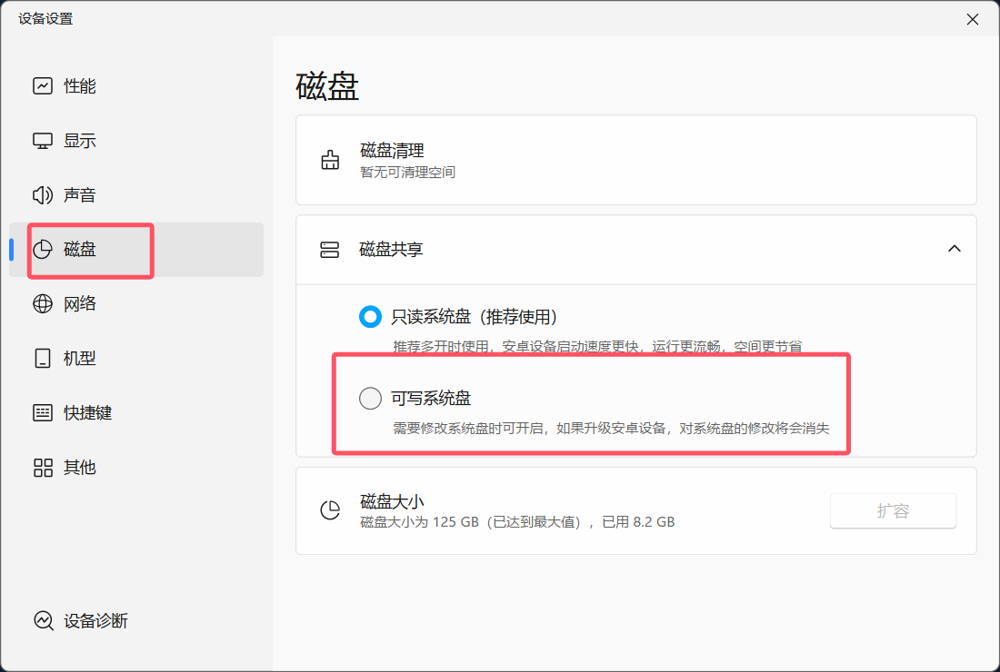

   5.在“网络”中，确认你的网络桥接已经关闭，然后重启模拟器

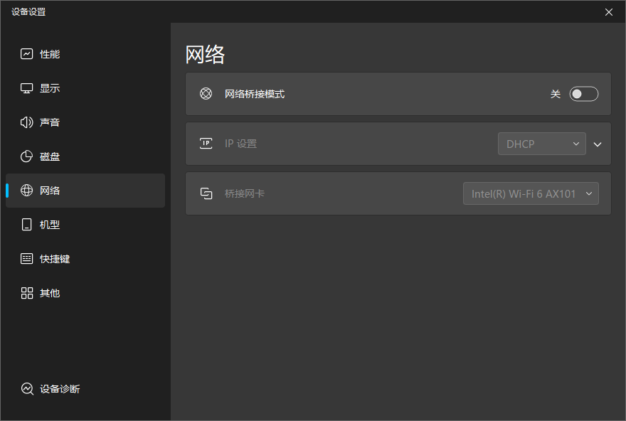

6. 之后，在你的MuMu模拟器上下载你要抓包的服务器版本，随后和你之前做过的一样进入游戏下载数据，进入游戏，确认自己能够进入游戏主界面后我们便完成了准备工作

***请注意，如果你在这个阶段无法连接游戏服务器或者下载数据过慢，可以点击. . .选择游戏加速功能，里面有UU加速器可供使用***

## 安装证书

现在回到解压HarukiProxy的目录，双击HarukiProxy-vx.x.x.exe来打开

还有另外一种更加建议的方式，使用CMD来打开

在资源管理器的HarukiProxy安装目录中，点击上方的目录框，删除当前目录路径后，输入cmd,接着按回车

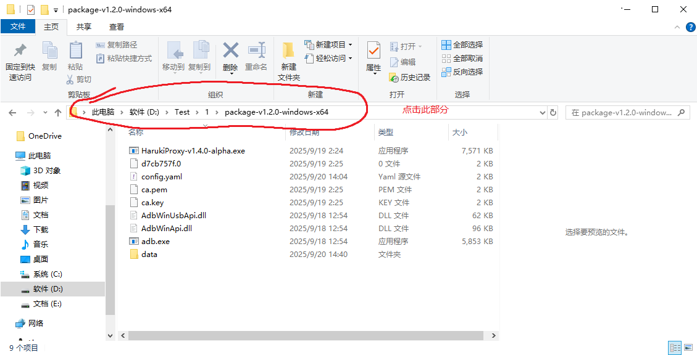

在随后弹出的CMD中，输入

```
HarukiProxy-vx.x.x.exe(可以在输入了前几个字符后按下Tab自动补全)
```

然后按回车来启动HarukiProxy

随后回到MuMu模拟器，当弹出请求root权限时选择允许,之后等待HarukiProxy完成自己的工作，当HarukiProxy弹出请重启模拟器的提示时，重启模拟器来完成证书安装

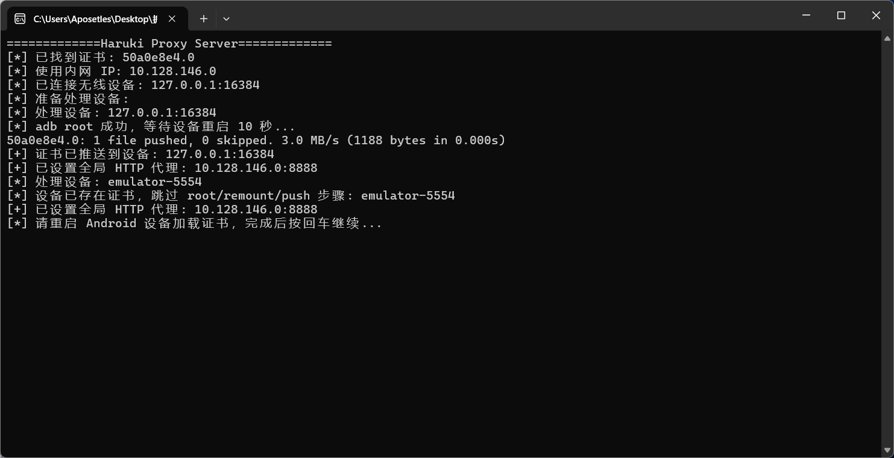

> [!caution]
>
> **弹出请重启模拟器的提示前请不要退出MuMu模拟器，否则证书会安装失败***
>
> ***如果你前面使用了MuMu模拟器自带的游戏加速功能，或是你自己在模拟器里使用了什么加速器，这时都该关掉了，不然接下来会抓取不到数据***

## 抓取

重启完模拟器后，HarukiProxy应该会弹出

```
goproxy MITM 代理启动: 0.0.0.0:8888
```

随后出现一些开头为WARN的消息，如果格式为Cannot read TLS response那就是正常现象

### suite数据

在登录界面进行登录操作后可以抓取

### mysekai数据

打开mysekai，等到你的豆腐人走出房门，看到如下提示，那么Mysekai数据抓取就顺利完成了

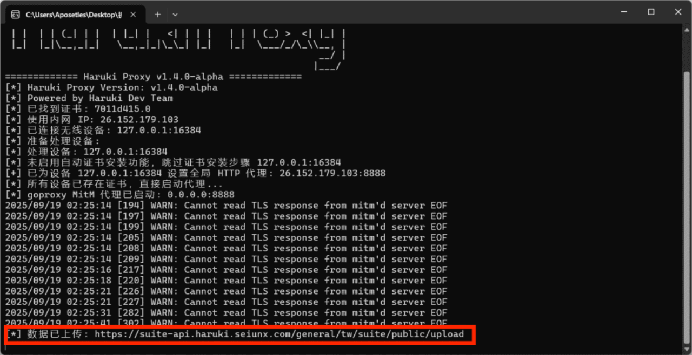

或者使用msa或者msm进行测试是否抓包成功

> [!tip]
>
> 如果遇到bot“你上传的MySekai数据里没有正确的数据哦。”，请去编队随便交换个人再进入烤森抓包

> [!caution]
>
> 当你抓包结束后不需要抓包时请使用快捷键Ctrl+C退出exe程序，直接关闭窗口将不保证能清除代理，可能会导致模拟器无网络连接

# 问题自查

如果在执行文档中的教程时出现问题时，请先查阅此部分进行修复

## 程序闪退

1. 按下键盘上的`Win + R`键，会弹出一个“运行”对话框。在里面输入`cmd`，然后按回车。
2. 在.exe 文件的文件夹上方的地址栏上单击地址栏，路径就会被完整选中，右键点击选中的路径，选择“复制”
3. 在命令行中输入`cd`，然后加一个空格，再按`Ctrl+V`粘贴你刚刚复制的路径，最后按回车，可以看到命令行中的路径现在和你的程序所在路径一致
4. 输入`HarukiProxy`后按tab可以发现会补全为你下载版本的harukiproxy.exe，回车即可以运行
5. 你现在可以看到具体的报错，把它复制到浏览器查阅或者询问ai

## 默认ip配置失效

```
android_proxy_ip: "" # 手动设置代理IP，如果自动获取IP并设置会导致模拟器/设备无法联网，请填写此项
```

请将你正在操作的这台电脑（抑或是其它设备，总之是你要运行MuMu模拟器和HarukiProxy的这台设备）的ip地址填入""中

如果你不知道自己的ip地址的话，请按照以下流程

- Windows：同时按下键盘上的WIN+R两个键，右下角会弹出“运行”窗口，在窗口中输入cmd并回车

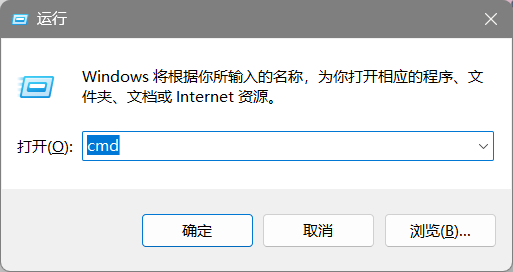

接着，在弹出的界面中输入ipconfig，从出现的内容中找到以太网适配器 以太网 或 无线局域网适配器 WLAN，下方的IPV4/IPV6地址即为你的当前地址

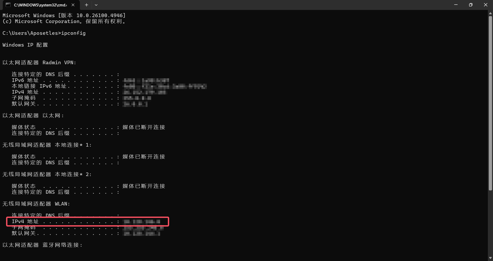

## 模拟器连不上网

当你使用HarukiProxy完成抓包后，如果模拟器没能正常联网，则可以使用adb工具进行设置的全局代理

进入CMD(在文章的确认主机IP已提到过)，之后在终端输入

```
adb -s 127.0.0.1:16384 shell settings put global http_proxy :0
```

>    [!caution]
>
>    （这里的端口也请记得改成自己的）

即可恢复网络

## config.yaml配置相关

### 连接adb设备失败

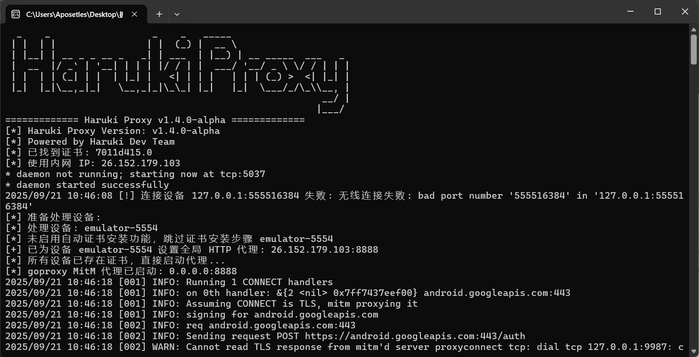

请查找

  - ```
    # Android 设备列表
    
    devices:
    
      - serial: "" # 有线连接的Android设备名
        wireless: "127.0.0.1:16384" # 无线连接的Android设备名（IP:端口）
    ```

    中的端口是否配置正确

### 配置了上游代理后闪退

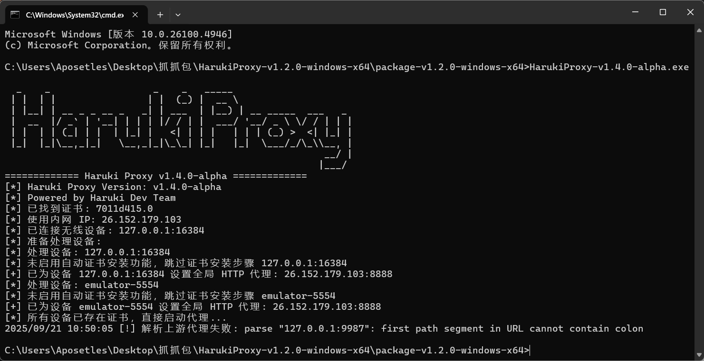

请查找

```
goproxy_upstream_proxy: ""
```


中的配置是否为http://127.0.0.1:xxxx的形式，可能会遗漏http://

### 配置文件发生错误

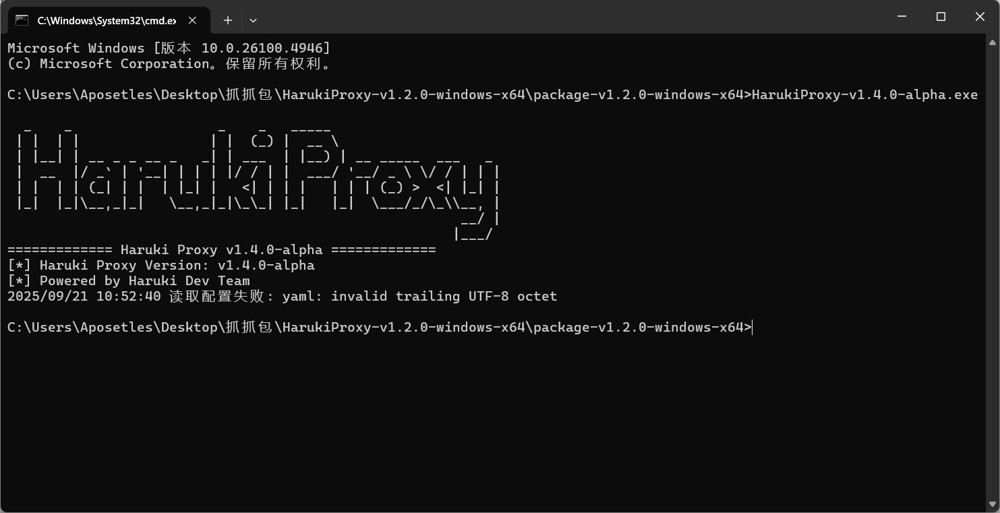

也许在你确认了全部的配置都没有问题保存后，可能还会遇到编码问题，我们的配置文件使用的是标准的UTF-8编码，因此使用其它方式(如使用记事本）编码后得到的配置文件会发生编码错误

最好的处理办法就是重新拿一份配置文件，更改你的记事本编码方式或者使用专业编辑器（如VSCode）编辑，然后用正确的编码方式保存

## HarukiProxy 更新记录

### v1.4.0

- 新增是否自动上传到Haruki Toolbox
- 新增自定义上传数据端点
- 新增是否保存数据到本地
- 新增是否保存suite数据到本地
- 新增是否保存mysekai数据到本地
- 新增是否自动通过adb安装证书

### v1.2.0

- 为生成Root CA时的CA名字添加随机参数
- 退出程序时自动清理adb设备的代理

### v1.1.1

- 添加Haruki声明

### v1.1.0

- 改善获取内网IP的逻辑

### v1.0.0

- 初版

